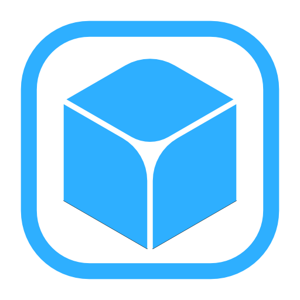

<p align="center">
  
</p>

<h1 align="center">RoundifyPart</h1>

<p align="center">
  A Roblox Studio plugin that bevels (rounds) the edges and corners of BaseParts using primitive geometry.
</p>

<p align="center">
  
  
  
  
  
</p>

---

## Quick Demo

<p align="center">
  <video src="assets/usageDemo.mp4" controls width="600"></video>
</p>

## Features

- **Non-destructive rounding** - select any BasePart, choose a radius, and generate a rounded version composed of boxes, cylinders, and spheres.
- **Re-round & update** - adjust the radius of previously rounded models at any time; the plugin stores the original part dimensions as attributes.
- **Union on bake** - optionally union the generated primitives into a single UnionOperation.
- **Undo support** - all operations are recorded with `ChangeHistoryService` so Ctrl+Z works as expected.
- **Native Studio look** - the widget UI is built with Fusion and themed Studio components.

## Installation

1. Build the plugin with [Rojo](https://rojo.space):
   ```
   rojo build plugin.project.json -o Roundify.rbxm
   ```
2. Place the output file in your Roblox Studio **Plugins** folder.

## Usage

1. Open the **Roundify** widget from the toolbar.
2. Select one or more BaseParts in the viewport.
3. Set the desired bevel radius.
4. Click **Roundify** to generate the rounded model.

To update an existing rounded model, select it and adjust the radius.

## Tech Stack

- [Fusion 0.2](https://elttob.uk/Fusion/) - reactive UI framework
- [Promise](https://eryn.io/roblox-lua-promise/) - async utilities
- [Janitor](https://github.com/howmanysmall/Janitor) - cleanup management

## License

This project is licensed under the [MIT License](LICENSE).
